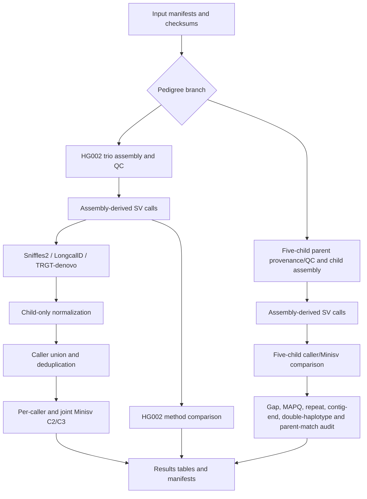

# Two-family analysis flow

The endpoint is a reproducible results package and an explanation audit for the five-child discrepancy. This workflow does not define a new truth set and does not include the legacy 17-truth rescue experiments.
